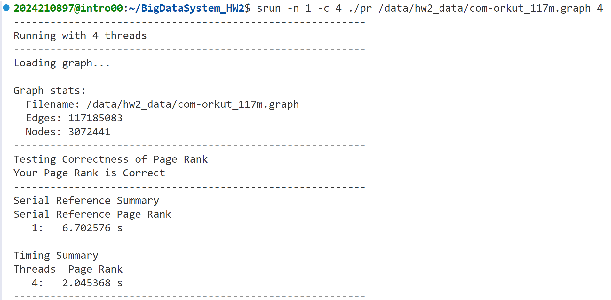
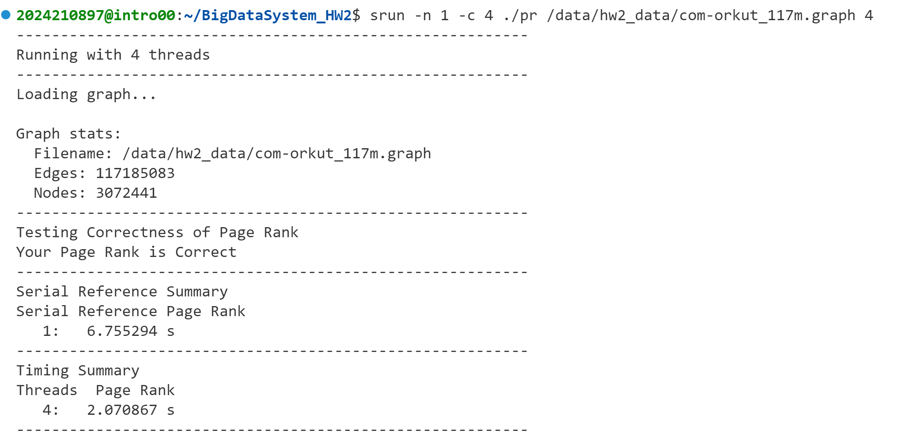

# 实验报告
## 实现方法
对于初始化部分，通过 #pragma omp parallel for 将初始化循环并行化。
对于主循环，每次迭代首先通过 #pragma omp parallel 进行并行化；计算每个节点的 score_new 值时，使用 #pragma omp for nowait 并行化。
因为 broadcastScore 是所有线程共享的，因此使用局部变量 localBroadcastScore 存储每个线程的值，最终通过 #pragma omp critical 将其合并到全局的 broadcastScore。最后，使用 #pragma omp for reduction(+:globalDiff) 来并行计算 globalDiff，并将每个线程的结果累加到全局的 globalDiff。
## 实验结果
在 1 线程下，实验结果如下：

在 2 线程下，实验结果如下：

在 3 线程下，实验结果如下：

在 4 线程下，实验结果如下：

汇总结果如下表：
| 线程数 | 运行时间（s） |
| ------ | ----------- |
| 1      | 6.675178 s  |
| 2      | 3.709480 s  |
| 3      | 3.036968 s  |
| 4      | 2.045368 s  |
## 不同 OpenMP 调度策略的结果
在代码中添加`#define USE_REDUCTION`并进行编译可测试不单独对每个线程的localBroadcastScore进行求和，而是直接使用OpenMP的reduction进行求和的算法用时。在 4 线程下，实验结果如下：

用时与不使用reduction相比略长，但差距不大。猜测可能为评测机性能波动导致。
## 速度提升不到 4 倍的原因
在实验中，4 线程的运行时间为 2.045368 s，而 1 线程的运行时间为 6.675178 s，速度提升不到 4 倍。这可能是由于以下原因导致的：
1. 线程间的通信开销：在每次迭代中，broadcastScore 是所有线程共享的，因此需要使用 #pragma omp critical 来保证线程安全，这会导致一定的性能损失。
2. 线程间的负载不均衡：在每次迭代中，每个线程的工作量不一定相同，可能会导致一些线程提前完成工作，而其他线程仍在工作，这会导致一定的性能损失。
3. 线程创建和销毁的开销：线程的创建和销毁也会带来一定的开销，可能会导致性能损失。